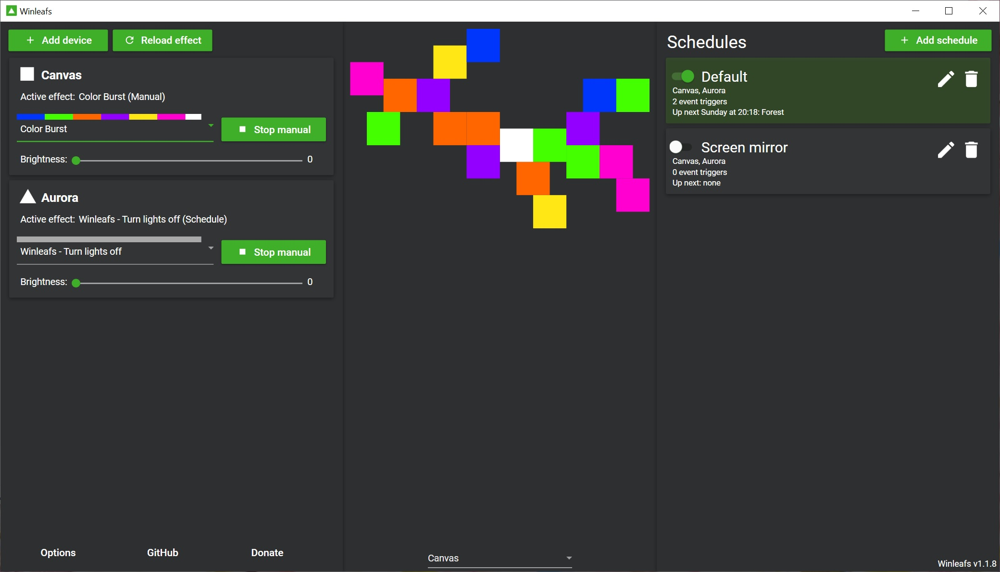
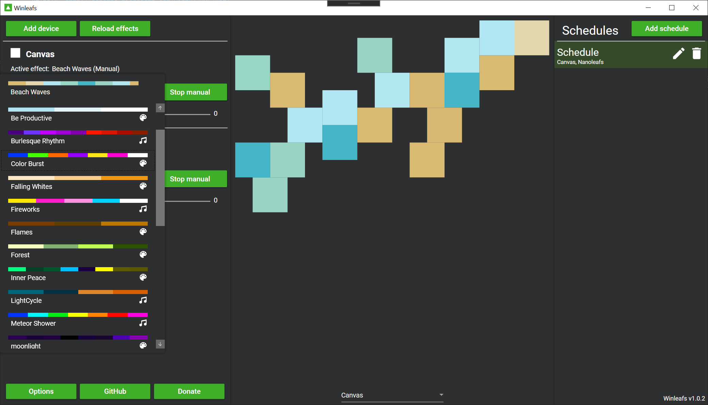
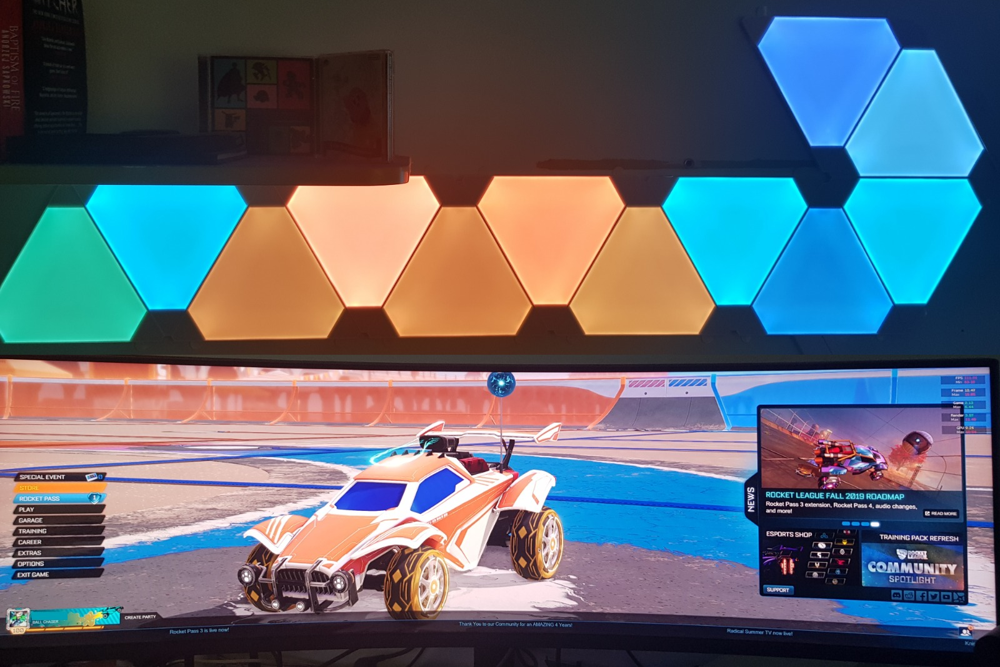

#  Winleafs

 Windows application for Nanoleaf lights.

Installers can be found on the [release page](https://github.com/StijnOostdam/Winleafs/releases).

## Features
- Supports both Aurora and Canvas
- Make multiple weekly schedules for your Nanoleaf lights
- Supports multiple devices simultaneously
- Add time based triggers to automatically set your lights to an effect and brightness at your chosen time
- Add triggers based on your sunrise and sunset times (requires location)
- Screen mirror, project your screen (like Netflix or games) onto your lights and your lights will be the same color as their position on your monitor
- Ambilight, make your lights the average color of your monitor
- Start the program at Windows startup
- Automatically turn off your lights when your PC shuts down
- All settings are saved locally

## TODOs & Future features

TODOs and future features can be found on the [GitHub projects board](https://github.com/StijnOostdam/Winleafs/projects/1). Any issue or card in the "in progress" column will be part of the next release (probably).

## Support

You can [donate to us using Paypal](https://www.paypal.me/winleafs). 
Note: all donations will go towards buying more Nanoleaf products for *"Testing purposes"*.

You can also make a fork of this project and pick up a task from our projects board.
We would appreciate it if you'd contact us before picking up a task so we can avoid doing double work.

## Showcase

### Screen Mirror

- [Beat Saber Ambilight](https://www.youtube.com/watch?v=CRe0o0TNlT4)
- [Screen mirror](https://www.youtube.com/watch?v=iT_jQnQLVQA)

## Troubleshooting
If you are experiencing problems, try deleting the settings file from %appdata%/Winleafs. Note: this removes all settings and schedules. Otherwise, you can create an issue [here](https://github.com/winleafs/Winleafs/issues/new/choose) and we will get back to you as soon as possible.

## Projects and APIs used

- [Icanhazip](http://icanhazip.com) To retrieve your IP address
- [IP-API](http://ip-api.com/) To get your location based on your IP address
- [Sunset Sunrise](https://sunrise-sunset.org/api) To get sunrise and sunset times based on your location
- [Modern UI Icons](http://modernuiicons.com/) Icons in this project
